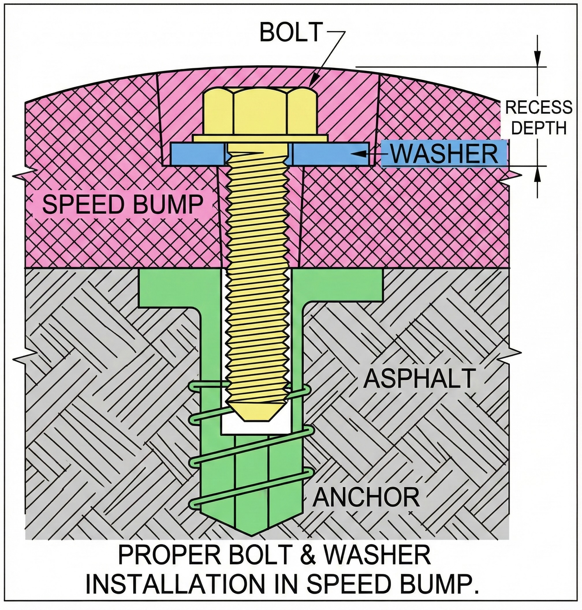

## Summary
* Speed Bumps are one of the top use cases for Asphalt Anchors.
* Use the SP18 or SP58 only. There are surprisingly large forces applied to speed bumps, and smaller anchors will fail.
* You will need to buy longer bolts at your local hardware store.

## Background
Plastic or rubberized speed bumps and speed humps are some of the more popular applications for our Asphalt Anchors. These devices, sometimes called traffic calming, are installed across a traffic lane to induce drivers to slow down.

Speed humps are a shallow version of speed bumps and have gained popularity over speed bumps as they are less jarring and less damaging to low-slung cars. The devices covered here are installed after the roadway has been completed and are attached to the roadway with anchors. 

Most add-on speed bumps are made from plastic or recycled rubber. Steel bumps are used where heavy truck traffic will wear out other materials too fast. In all cases, these bumps see large forces as the vehicle passes over them. The heavier the vehicle the larger the sideways (shear) forces. Plastic bumps can handle heavier traffic than rubber bumps, but rubber is recommended for residential and light commercial traffic as they are quieter and reduce the forces transmitted to the asphalt by absorbing some.

## Types of Anchor
Asphalt yields to repeated or constant pressure. Anchoring speed bumps to asphalt is thus very different from anchoring to concrete. In concrete a simple expansion anchor applies pressure against the hole walls as the bolt it tightened, and the friction caused by this force will hold the speed bump securely for a long time.

Using these same expansion anchors on asphalt, however, will fail in days, because as the asphalt yields to the force applied by the anchor, the friction between the asphalt and the anchor will steadily drop to nothing. Asphalt Anchors, on the other hand, bond the anchor to the asphalt chemically in a stress-free bond that will last for years.

## Asphalt Anchors
Vehicles hitting speed bumps transmit significant force in a very short period of time. This requires our strongest anchors. For residential use the SP18. For commercial and heavier traffic, use the SP58.

## Preparation
Speed bumps are secured to the asphalt by first installing the anchors into the asphalt, then attaching the bumps to the anchors using bolts and washers. Most speed bumps accommodate up to a 3⁄4” diameter bolt and require bolt length of about 3.5”. The hole shown in the picture is a recess for the bolt head. It is essential that the bolt heads stay below the top of the drivable surface to prevent damage to the tires. The diameter of the recess in the speed bump holes must accommodate the head of the bolt plus a socket that will be used to tighten the hex-headed bolts. If the recess available is too small, specify a socket bolt.

## Bolts
Speed bumps require longer bolts than these pre-installed in the anchors, due to the height of the speed bump. The length of the bolt should be calculated so that it will not penetrate more than 3" into the anchor and not less than the bolt’s diameter. There is no strength benefit in using a longer than the minimum required length of the bolt.

Make sure that you order continuous thread bolts: 
* SP18: Grade 5 7/16"-14
* SP58: Grade 5 5/8”-11

## Thread Lubricant
Due to salt, oils and other chemicals that find their way to the bolts and anchors, you need to protect the thread of the bolts using an anti-seize lubricant. If you use the bolts that are supplied with the anchors, these are already lubricated. If you provide your own bolts, use Permatex anti-seize paste to facilitate removal of the bolts in the future. Use #80078 for steel anchors, #77124 for stainless steel anchors.
